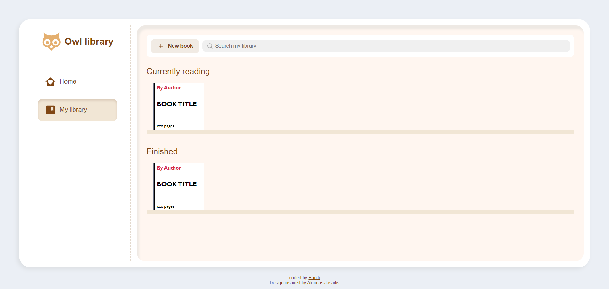
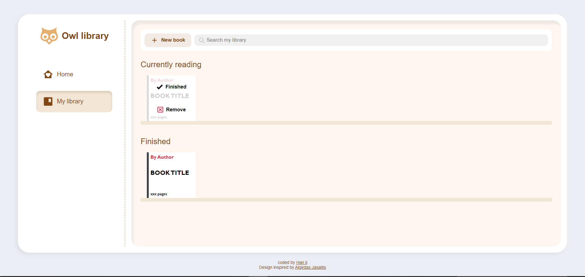
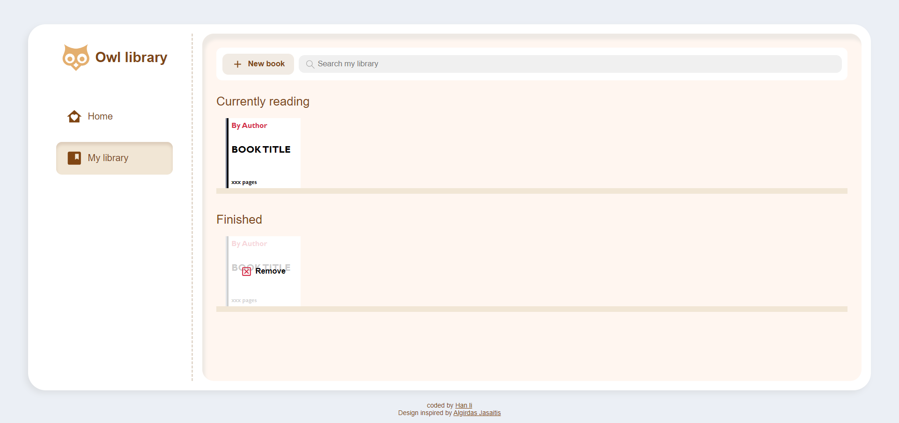
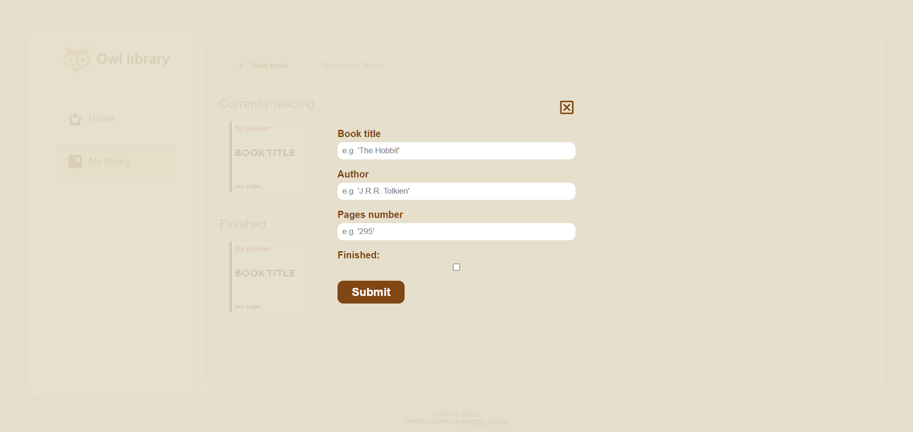
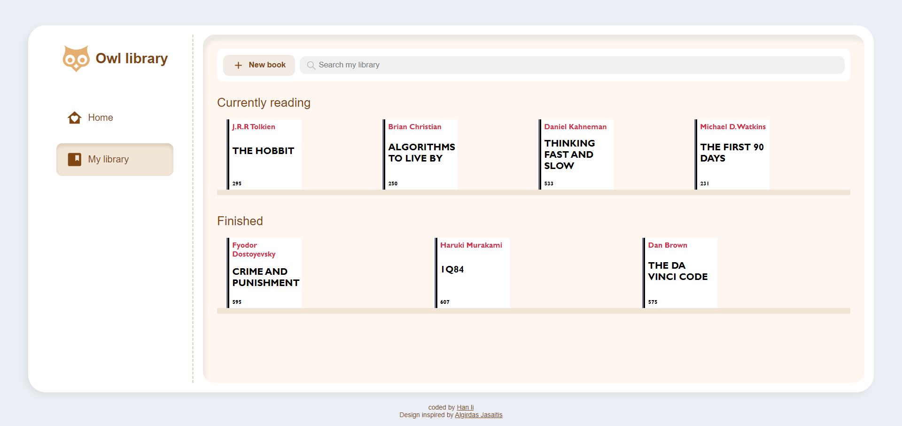

# the-odin-library

This is a solution to the the-odin project [Library project](https://www.theodinproject.com/lessons/node-path-javascript-library).

## Table of contents

- [Overview](#overview)
  - [The challenge](#the-challenge)
  - [Screenshot](#screenshot)
  - [Links](#links)
- [My process](#my-process)
  - [Built with](#built-with)
  - [What I learned](#what-i-learned)
- [Author](#author)
- [Acknowledgments](#acknowledgments)

## Overview

### The challenge

Users should be able to:

- Add books to the page with details of each book's: author, title and number of pages.
- Remove a book from the shelf if the remove button was clicked.
- Move a book to finished shelf if the finished button was clicked.

### Screenshot







### Links

- Solution URL: [solution URL](https://github.com/bashair0/the-odin-library?tab=readme-ov-file)
- Live Site URL: [live site URL](https://bashair0.github.io/the-odin-library/)

## My process

### Built with

- Semantic HTML5 markup
- CSS custom properties
- java script

### What I learned

I learned how create so many objects that share the same characteristic using a constructor function.

```js
function Book(title, author, pagesNum, isRead) {
  (this.title = title),
    (this.author = author),
    (this.pagesNum = pagesNum),
    (this.isRead = isRead);
}
```

## Author

- github - [bashair0](https://github.com/bashair0)
- Frontend Mentor - [@bashair0](https://www.frontendmentor.io/profile/bashair0)

## Acknowledgments

The design of the webpage was inspired by [Algirdas Jasaitis](https://dribbble.com/AlgirdasJasaitis)
